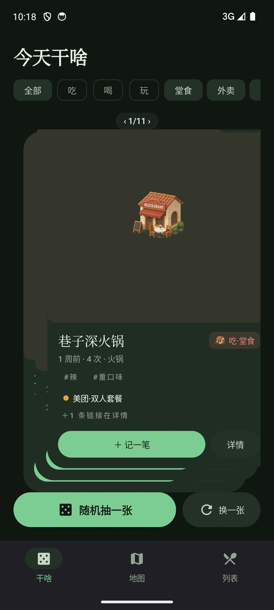
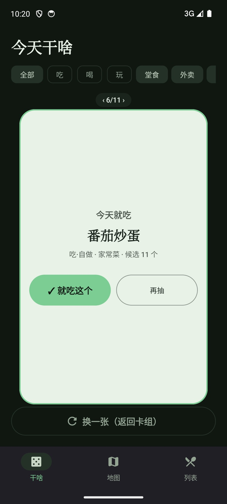
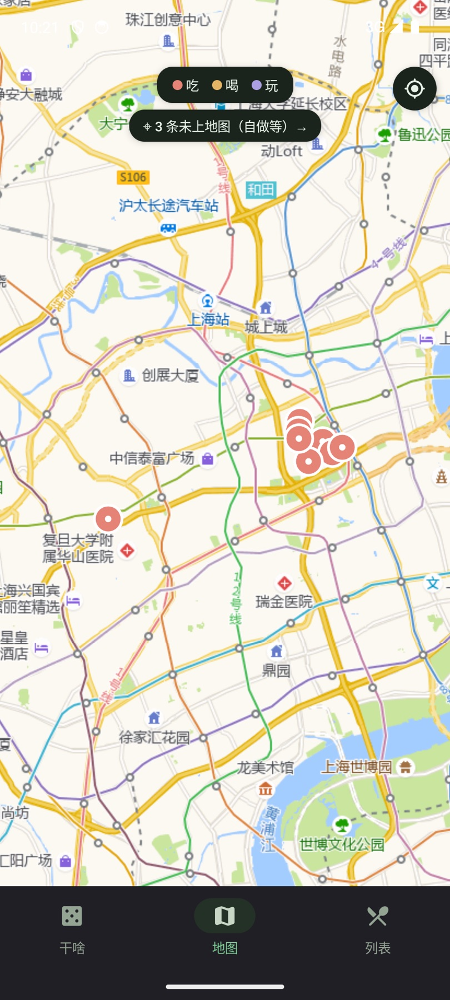
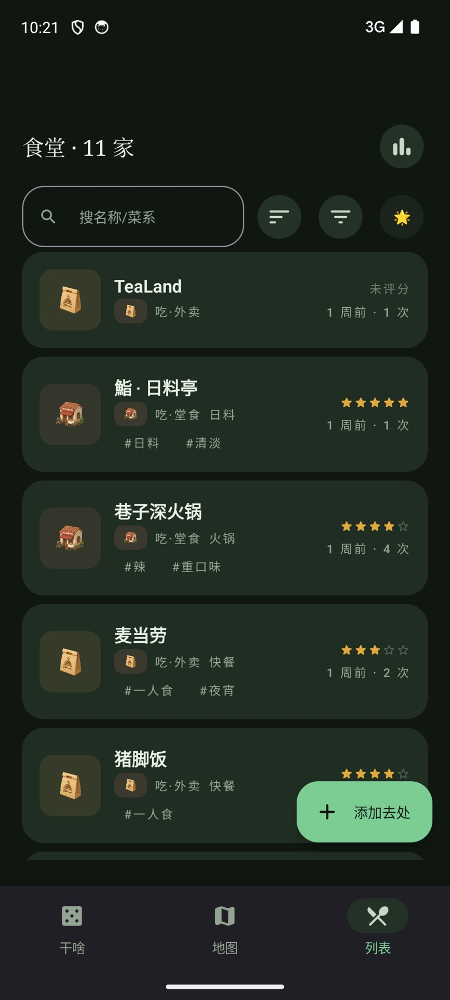
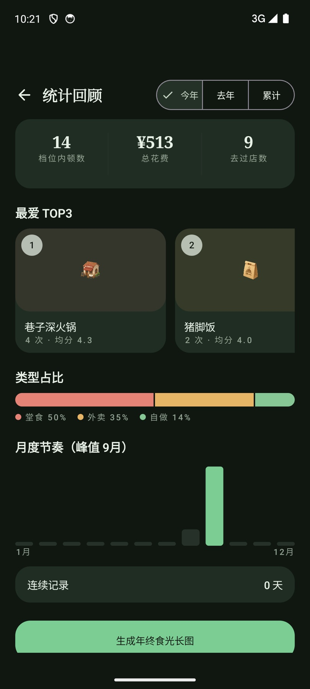

# 吃啥 (eats)

记录堂食 / 外卖 / 自做三类吃饭（以及喝、玩）选项：地图标记、最近一次追踪、卡组快速决策、统计回顾、愿望清单。

- **状态**：开发中（it-009）
- 规格文档：[specs/](specs/)，业务背景见 [specs/00-overview.md](specs/00-overview.md)
- 架构决策：[specs/06-decisions.md](specs/06-decisions.md)（含 ADR-002 高德瓦片修订、ADR-009 链接方案）

## 界面速览

> 以下截图均为应用内置**演示模式**数据。

| 干啥 · 卡组快速决策 | 抽卡结果 · 今天就吃 |
|---|---|
|  |  |
| *分类（吃/喝/玩）× 类型（堂食/外卖/自做）chips 过滤卡组，‹ n/m › 翻阅* | *「随机抽一张」翻牌动画后落定：就吃这个 / 再抽，彩屑庆祝* |

| 地图 · 高德瓦片标记 | 列表 · 搜索/排序/筛选 |
|---|---|
|  |  |
| *●吃 ●喝 ●玩 三色 marker，一键回位框住全部；自做等未定位条目有胶囊提示* | *综合评分 / 次数 / 上次去一目了然，右上角进统计回顾* |

| 详情 · 一套口径的统计 | 统计回顾 · 年度食光 |
|---|---|
|  |  |
| *综合★ · 均分 · 次数 · 上次；链接、备注与去过记录时间线* | *三大数字带 + 最爱 TOP3 + 类型占比 + 月度节奏，可生成年终长图* |

## 构建

与 `wardrobe/` 同基线（ADR-001）：JDK 17 + Android SDK（platform 35 / build-tools 34+）。

```bash
./gradlew assembleDebug   # APK → app/build/outputs/apk/debug/
./gradlew test            # JVM 单测（domain/data，无需模拟器）
```

## 演示数据

```bash
tools/demo-data.sh [device-serial]   # 生成 8 家食堂/11 条记录并推入设备（debug 包，经 run-as）
```

## 素材署名

应用图标与界面 3D 图标来自 [Thiings](https://www.thiings.co)（免费素材，个人非商业用途）。
