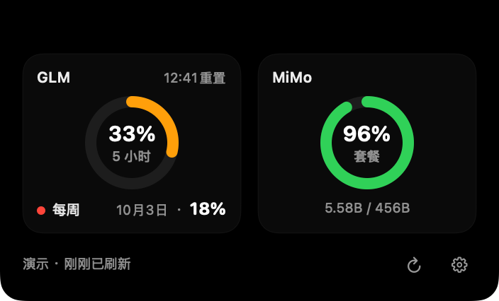
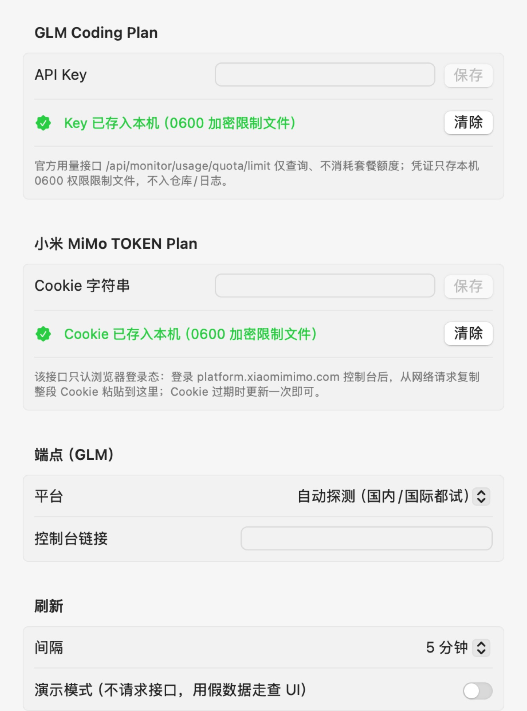

# 灵岛（island）

Mac 刘海处的**功能入口容器**：默认完全隐形，鼠标移到刘海即动画展开内容卡片。

## 界面速览

| 内容卡片（双源并排） | 设置窗（凭证 0600 本机文件化） |
|---|---|
|  |  |
| *GLM 与 MiMo 各一个主环：环心=剩余%+档名，颜色=健康度（绿/橙/红），环下明细行；按源状态独立* | *API Key / Cookie 只存本机 0600 限制文件，不入仓库/日志；刷新间隔与演示模式在此切换* |

当前接入的内容源（`ProviderRegistry` 单表驱动，可插拔扩展）：

- **GLM Coding Plan TOKEN 用量**——每源一个面板：单主环（环心=剩余%+档名、颜色=健康度），
  环下明细行（每周档重置 / 百分比）；
- **小米 MiMo TOKEN Plan**（Cookie 认证）——套餐主环 + 已用/额度绝对量行。

按源状态独立：任一源失败只在该源面板与页脚明示，他源照常展示。
规格文档见 [specs/](specs/)，当前进度见
[specs/iterations/it-003-card-rework-and-registry.md](specs/iterations/it-003-card-rework-and-registry.md)。

## 构建 / 测试 / 打包

只需 Command Line Tools（无需完整 Xcode），macOS 14+：

```bash
swift build              # 构建
swift test               # 单测（swift-testing，CLT 无 XCTest）
./tools/make-app.sh      # 打包 → 仓库根 dist/island.app（ad-hoc 签名，不入 git）
```

## 运行

```bash
open /path/to/dist/island.app
```

- 默认无任何常驻 UI；鼠标移到刘海触发展开，点击可固定，移开/点外部收起。
- 首次使用：菜单栏图标 → 设置 → 粘贴 API Key / MiMo Cookie
  （只存本机 `~/Library/Application Support/island/credentials.json`，**0600 权限限制文件**，
  不入仓库/日志；钥匙串因 ad-hoc 重签名 ACL 失效已迁出，ADR-010）。

### 调试钩子（环境变量）

| 变量 | 作用 |
|---|---|
| `GLM_ISLAND_DEMO=1` | 强制演示模式（假数据，不请求接口） |
| `GLM_ISLAND_EXPAND=1` | 启动即固定展开 |
| `GLM_ISLAND_SEED_KEY=xx` / `GLM_ISLAND_SEED_MIMO_COOKIE=xx` | 首启注入凭证文件（空时才写） |
| `GLM_ISLAND_SHOT=<目录>` | DebugShot 自截图：~2.2s 渲染岛卡 PNG 后退出（ADR-011） |
| `GLM_ISLAND_SHOT_SETTINGS=1` | 连设置窗一起截图 |
| `GLM_ISLAND_BLANK=1` | 视作全未配置（空态走查） |

> 本 README 顶部的界面截图即由上表钩子产出（`GLM_ISLAND_EXPAND=1` + `GLM_ISLAND_SHOT`）。

走查截图一行复现（演示数据 + 展开 + 设置窗）：

```bash
swift build && \
GLM_ISLAND_DEMO=1 GLM_ISLAND_EXPAND=1 \
GLM_ISLAND_SHOT=/tmp/island-shots GLM_ISLAND_SHOT_SETTINGS=1 \
.build/debug/Island
```

## 接入真实数据

```bash
GLM_API_KEY=你的Key ./tools/spike-usage.sh          # 国内 bigmodel.cn
GLM_API_KEY=你的Key ./tools/spike-usage.sh zai      # 国际 z.ai
```

真实接口契约（spike 已校准）见 [specs/03-data-model.md](specs/03-data-model.md)。

## 已知限制

- 展开卡片顶边贴屏幕顶沿，会临时盖住该跨度内的状态图标，移开或点击外部即让位；
- 系统级全屏截图不合成该层窗口，`screencapture -l` 又需屏录 TCC 授权——
  **走查一律用 DebugShot 自截图**（上表 `GLM_ISLAND_SHOT`，无授权依赖）；
- 菜单栏图标/系统 UI 不在 DebugShot 覆盖内，需人工目检；
- 开机自启（SMAppService）需 .app 形态，裸 `swift run` 下开关会报错并回显原因。
