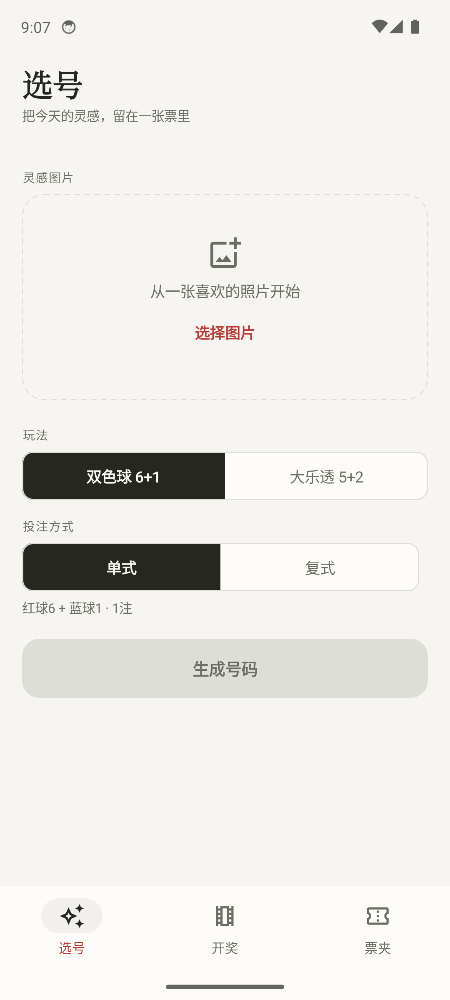
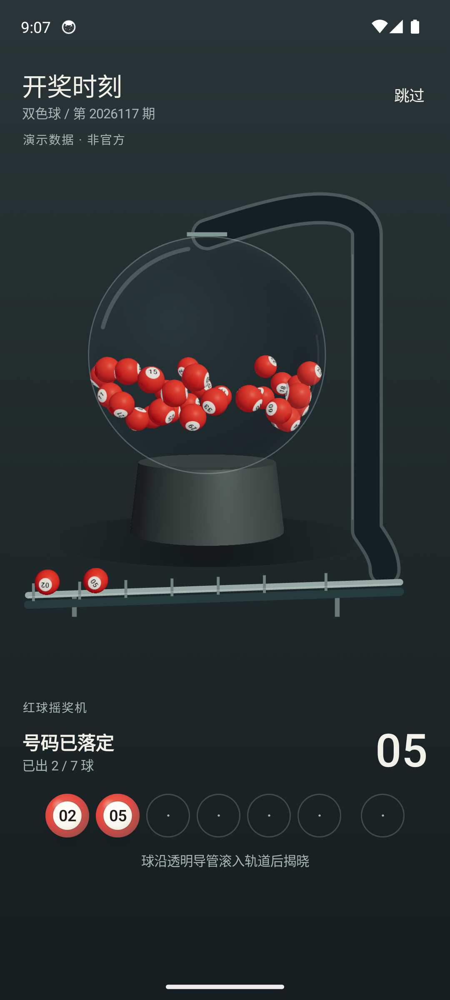
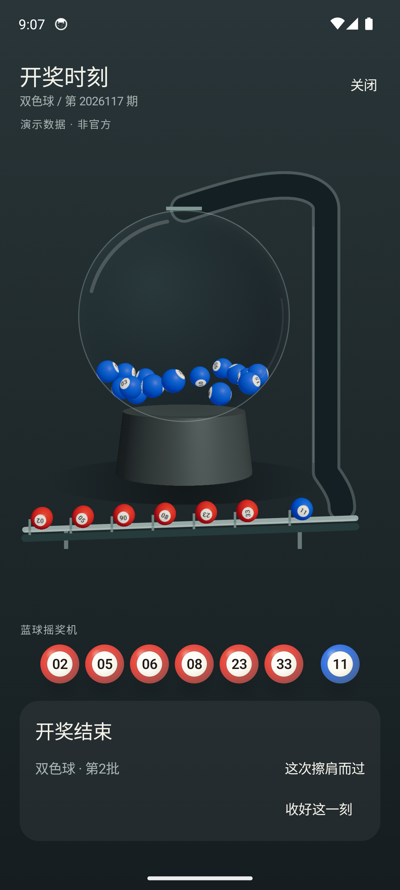
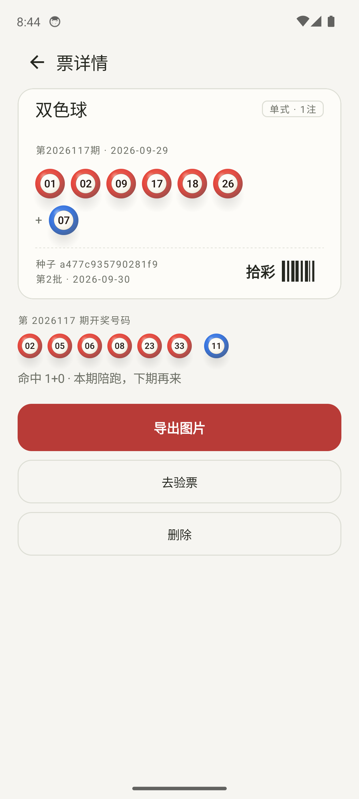
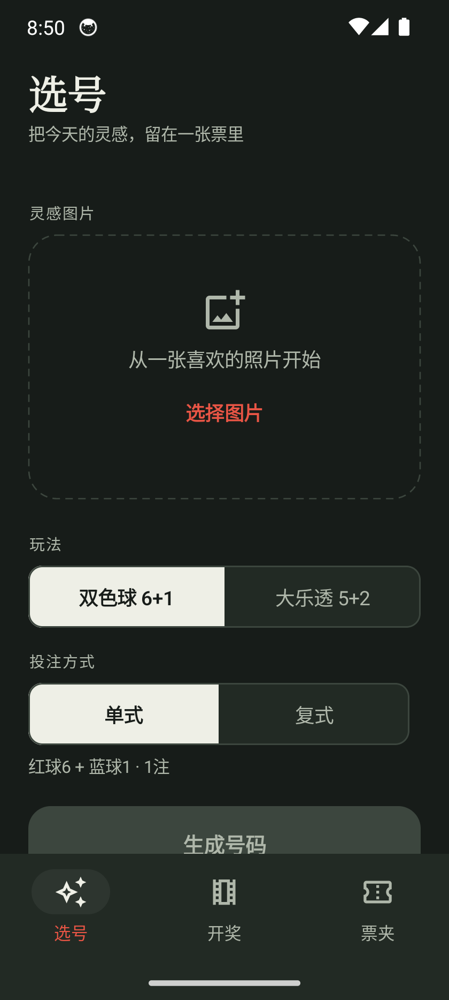
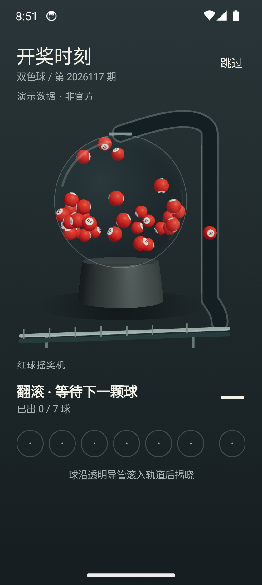

# 拾彩 it-003 实机界面与运行验证（2026-09-30）

实际运行环境：应用独占 lottery_qa / Android Emulator，host硬件GPU；APK0.2.0(2)。真机性能与用户视觉体验待验。

## 视觉

| 选号 | 摇奖机运动 | 完整揭晓 |
|---|---|---|
|  |  |  |

| 票详情 | 320dp深色 | 320dp剧场 |
|---|---|---|
|  |  |  |

其他证据：`final-draw.png`、`final-tickets.png`、`final-dlt.png`、`final-resume.png`、`final-skip.png`、`final-simple.png`、`final-scale-zero.png`、`final-narrow-combo.png`、`final-generated-ticket.png`。生成测试图片使用 `python3 lottery/tools/qa-seed.py`，不使用用户照片。

本地完整录屏：[replay.mp4](replay.mp4)，大文件不入git；录屏从点击开始后启动，包含静止堆积、气流翻滚、捕获、出管、滚轨与结束。运行数据：[runtime.log](runtime.log)、[最终APK复验](final-checks.log)。

## 验证结果

- `JAVA_HOME=/opt/homebrew/opt/openjdk@17/libexec/openjdk.jdk/Contents/Home lottery/gradlew -p lottery assembleDebug testDebugUnitTest`成功，35个JVM测试无失败，新增8个物理/连续旅程测试。
- 修正实际Surface尺寸后，连续完成DLT/SSQ/SSQ三轮，未发生原生崩溃；49/47个独立球体Transform实例与LIT渲染实际启用。DLT5+2与SSQ6+1分别完整揭晓。
- 普通最终DLT1184帧、SSQ1183帧，p50/p95均16.7ms、>32ms分别0/2帧；同时录屏SSQ1055帧、p50=16.7ms、p95=33.3ms、>32ms109帧。模拟平均耗时0.13–0.22ms；普通CPU渲染提交均值0.60–0.65ms。这是帧时钟及CPU提交统计，不能当作GPU真实呈现率。
- 首次GPU准备约2.4秒，缓存后约60ms；从GPU准备完毕到揭晓约19.7秒。准备前界面与静止球堆可见、跳过可用。
- 后台3秒暂停后继续，管轨与3D恢复对齐；跳过直接结束；简化开奖直接显示结果且重启保留；系统动画缩放0时仍播放内容，独立简化选项可直接结束。
- 320dp可滚动触达底部操作、复式号码换行；深色/浅色截图与窄屏剧场未见轨道越界。选图→复式生成完成；详情导出提示成功并写入Pictures/拾彩。

## 精确边界

球群具有真实受力积分与接触求解；指定号码捕获/管轨是连续约束路径，尚非全场刚体与管壁解算。球壳使用透明Fresnel材质、Canvas管轨及近似底影，没有精确光学折射。真机热稳定60fps、功耗与触感质量尚未验。最终视觉是否达到用户所期待的情绪价值，以实际体验反馈为准。

最终APK录屏复验：1099帧、p50=16.7ms、p95=33.3ms、>32ms64帧；简化设置重启保留、系统缩放0完整内容、剧场白色系统栏图标均通过。
