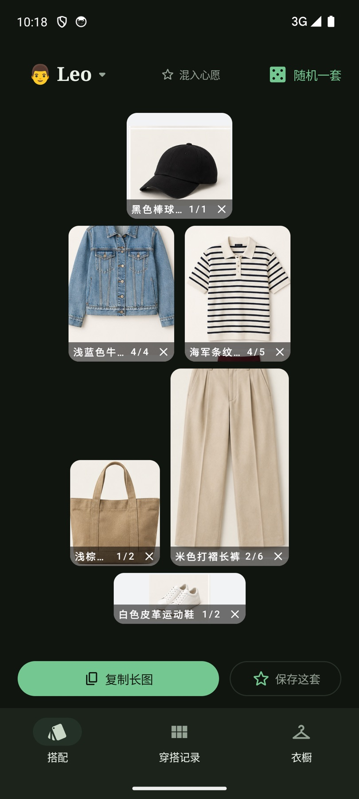
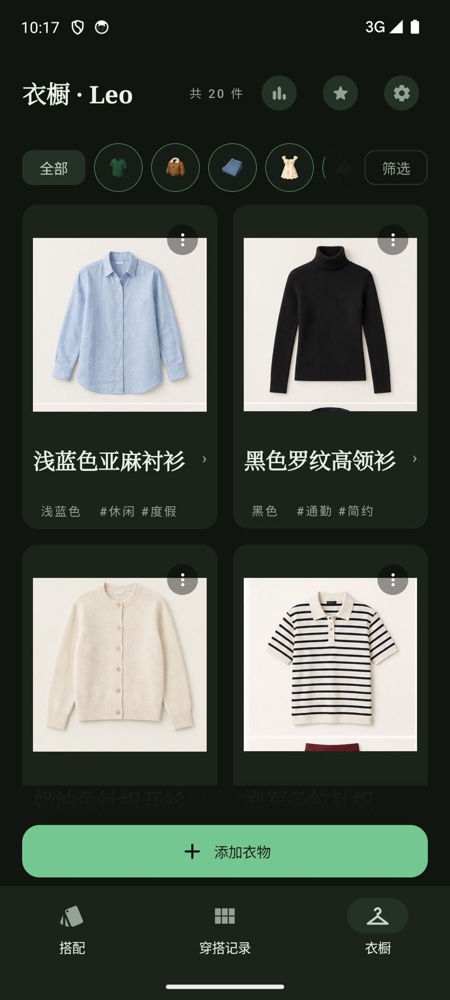
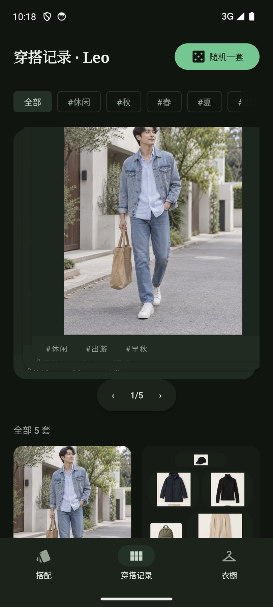
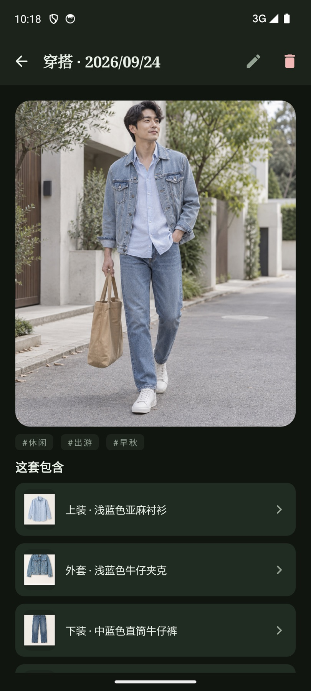
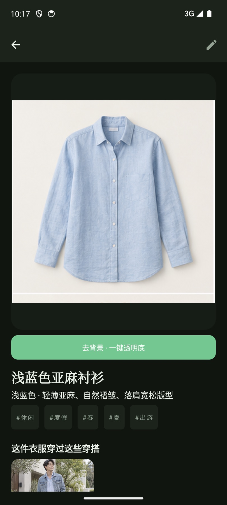
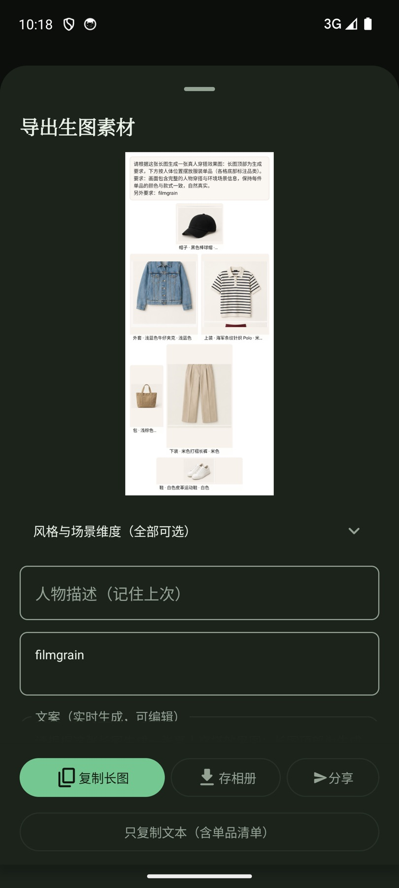
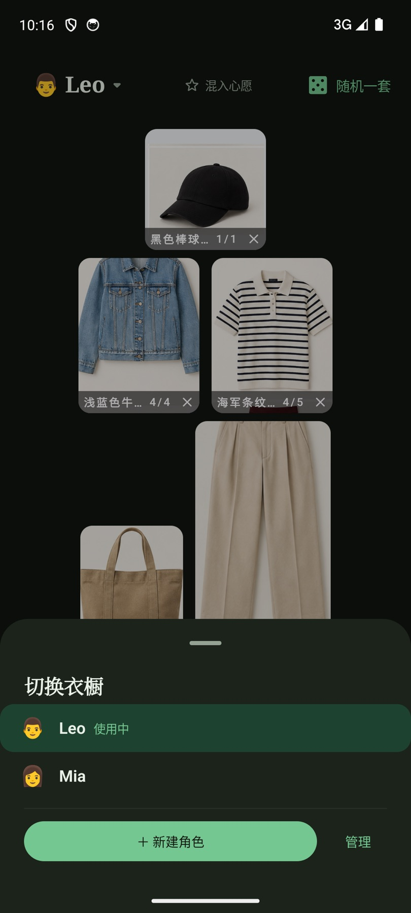

# 衣橱（Wardrobe）

个人用安卓原生应用：把衣物拍照录入，按品类槽位滑动组合穿搭，一键复制「合成图 + 描述文案」交给能生图的 AI Agent 生成真人穿搭效果图；生成的效果图再录回 App，与单品双向关联——看一件衣服知道它能配哪几套，看一套穿搭知道它由哪些单品组成。支持一台设备多角色（我 / 家人）各自的衣橱，单品与穿搭均可打标签、写评论。

完整产品与技术规格见 [`specs/`](specs/)（建议从 [`00-overview.md`](specs/00-overview.md) 读起）。

## 界面速览

> 以下截图均为应用内置**演示模式**数据（设置入口连点开关，真实衣橱零接触）。

| 搭配页 · 槽位组合穿搭 | 衣橱页 · 单品网格 |
|---|---|
|  |  |
| *按品类槽位放单品，n/m 计数辅助查缺；一键「复制长图」或「随机一套」* | *按分类/标签筛选浏览，共 68 件演示单品* |

| 穿搭记录 · 卡组翻阅 | 穿搭详情 · 效果图双向关联 |
|---|---|
|  |  |
| *保存下来的穿搭按标签筛选、随机抽取* | *AI 生成的真人效果图 + 「这套包含」单品清单，点击互跳* |

| 单品详情 · 一键去背景 | 导出面板 · 生图提示词 |
|---|---|
|  |  |
| *「去背景 · 一键透明底」端侧抠图；下方列出穿过它的穿搭* | *风格/场景维度选择器 + 自动生成的生图提示词，复制长图/存相册/分享* |

| 角色切换 · 多衣橱 | |
|---|---|
|  | *一台设备多角色（Leo / Mia），各衣橱数据独立* |

### 功能亮点

- **录入 → 去背景 → 组合 → 生图 → 回录** 全链路：端侧 u2netp 抠图（`libs/cutout`），导出长图带人体位置布局与提示词，AI 效果图回录后与单品双向关联。
- **卡组交互**：穿搭记录翻卡 / 随机一套（自研 `libs/carddeck` 内核，甩卡手感调校）。
- **多角色**、标签/评论、穿搭打卡与衣橱回顾、心愿清单、数据包导入导出。
- **演示模式**：不落盘的内置演示数据，真实衣橱零接触，走查/体验两相宜。

## 构建

```bash
# 首次：确保 JDK 17 与 Android SDK(platform 35) 可用，local.properties 指向 SDK
./gradlew assembleDebug
# 产物: app/build/outputs/apk/debug/app-debug.apk
```

安装/运行到模拟器用 **`tools/emu.sh`**（见下节）。多设备在线时不要裸用 `adb install` / `./gradlew installDebug`——会装到**所有**设备，和显影并行开发时会串包。

单元测试：`./gradlew test`

## 模拟器（设备分治）

衣橱独占 `wardrobe_*` AVD（主用 `wardrobe_test`），显影独占 `darkroom_*`，两应用可同时各开一台模拟器、互不抢前台：

```bash
tools/emu.sh up        # 启动/复用衣橱专属模拟器，打印序列号
tools/emu.sh install   # assembleDebug 并安装到本应用设备
tools/emu.sh launch    # 拉起应用；走查卡住用 restart 复位
tools/emu.sh cap       # 截图（uadump 出无障碍树）
tools/emu.sh serial    # 打印序列号，裸 adb 用 adb -s $(tools/emu.sh serial) ...
```

序列号按 AVD 名解析、不硬编码 `emulator-端口号`（端口随启停漂移）。约定与踩坑史见 [specs/it-002](../specs/iterations/it-002-emu-device-split.md)。

## 素材署名

应用图标与品类 3D 图标来自 [Thiings](https://www.thiings.co)（免费素材，个人非商业用途）。

## 技术栈速览

Kotlin · Jetpack Compose (Material 3 Expressive) · MVVM + 单向数据流 · Repository + JSON 文件存储（kotlinx.serialization）· Coil · Lottie。详见 [specs/04-architecture.md](specs/04-architecture.md) 与 [specs/06-decisions.md](specs/06-decisions.md)。
