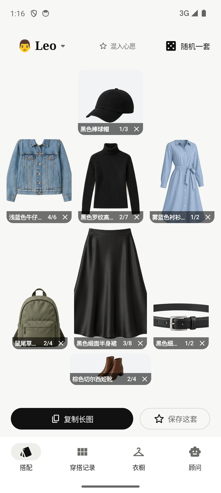
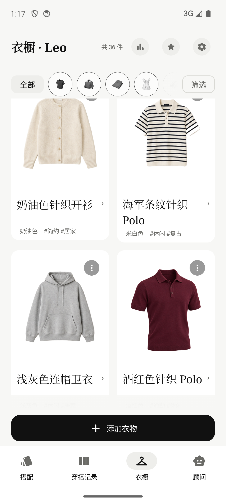

# it-060 · Mock 衣橱扩容验证

## 结果

- mock 数据：2 个角色、68 件单品、15 套穿搭、5 条评论、4 件心愿单品、1 套心愿穿搭。
- 八个品类均有数据：TOP 10、OUTERWEAR 11、BOTTOM 12、DRESS 8、SHOES 8、BAG 8、HAT 5、ACCESSORY 6。
- 新增 `item-37.png`～`item-68.png` 共 32 张 RGBA PNG，最长边 ≤768px，逐张存在 alpha=0 透明像素且 JSON 引用完整。
- 数据包 `wardrobe-ai-mock-20260929.zip`：`validate.py --app wardrobe` → **PASS，0 警告**。
- `./gradlew :app:testDebugUnitTest :app:assembleDebug` → **BUILD SUCCESSFUL**。
- `./gradlew :app:assembleDebug -PdemoDefault=true` + 模拟器冷启动 → **通过**；W1 能加载 mock 组合，W3 滚动可见新增酒红色针织 Polo 等透明单品。

## 截图

| 页面 | 证据 |
|---|---|
| W1 搭配页加载 mock 组合 |  |
| W3 衣橱页滚动看到新增单品 |  |

## 产物

- [可导入 mock 数据包](../../dist/wardrobe-ai-mock-20260929.zip)
- [体验包 APK](../../app/build/outputs/apk/debug/app-debug.apk)
