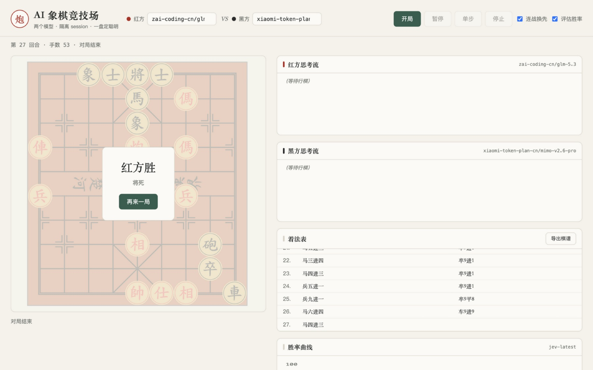

# xiangqi —— AI 象棋竞技场

本地 web 应用：两个大模型各开一个隔离的 **pi agent session**，对弈中国象棋，实时观战、累计胜负。

## 界面速览

| 对局全景（终局：红方胜 · 将死） |
|---|
|  |
| *左：棋盘与终局弹层；右：红/黑思考流、着法表（中文记谱）、Jev 胜率曲线，可导出棋谱* |

- 规则引擎：[xiangqi.js](https://github.com/lengyanyu258/xiangqi.js)（BSD-2，vendored）
- 棋盘 UI：[xiangqiboardjs](https://github.com/lengyanyu258/xiangqiboardjs)（MIT，vendored）
- agent 驱动：[pi](https://github.com/earendil-works/pi) `--mode rpc` 双子进程（需全局安装）

**对抗协议**：模型输出 ICCS 走法 + 合法走法白名单校验（非法注入纠错重试 ≤3），
超时静默判负可重试；双方 session 上下文隔离，靠真本事下棋。

## 运行

```bash
# 前置（一次性）
npm install -g --ignore-scripts @earendil-works/pi-coding-agent   # Node ≥ 22.19
# 至少配一个 provider 的 key，如：
export ZAI_API_KEY=...        # 智谱 GLM
# 或自定义 OpenAI 兼容 endpoint → ~/.pi/agent/models.json（见 pi docs/models.md）

# 启动
node server.mjs               # 默认 http://localhost:8777
```

浏览器打开后：选红黑双方模型 → 开局。key 只在 pi 与本机 env，永不进前端/日志/git。

## 文档

- specs：[00-overview](specs/00-overview.md) · [01-user-stories](specs/01-user-stories.md) · [02-wireframes](specs/02-wireframes.md) · [03-data-model](specs/03-data-model.md) · [04-architecture](specs/04-architecture.md) · [05-design-system](specs/05-design-system.md) · [06-decisions](specs/06-decisions.md)
- 当前迭代：[it-001 arena MVP](specs/iterations/it-001-arena-mvp.md)
- 过夜双局实战记录：`reports/2026-09-24-xiangqi-showdown/`（四模型 1:1）
